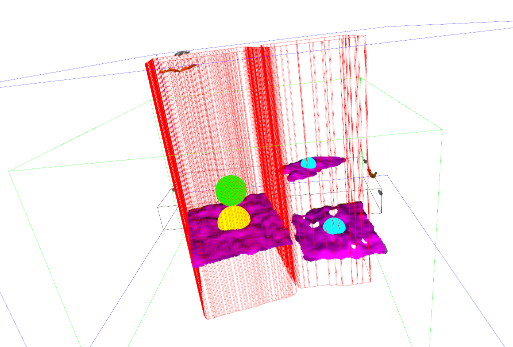

# Point Cloud Processing Pipeline



This project implements a pipeline for processing 3D point cloud data (PCD) to detect planes and segment objects. It uses Open3D for 3D processing and a 2D segmentation model (via Roboflow) to assist in region of interest selection.

## Features

- **3D Point Cloud Processing**: Loads RGB-D images and converts them to point clouds.
- **Preprocessing**: Applies cropping, statistical outlier removal, and normal estimation.
- **2D Segmentation Integration**: Uses a 2D object detection model to define prisms in 3D space for targeted processing.
- **Plane Detection**: Uses DBSCAN clustering and RANSAC to identify plane candidates.
- **Visualization**: Interactive 3D visualization of the processing steps and results.

## Dependencies

This project requires Python and the libraries listed in `requirements.txt`.

You can install them using pip:

```bash
pip install -r requirements.txt
```

**Note**: The project also imports a module named `inference`. Ensure this module is available in your python path or project directory.

## Data Structure

The project expects the following directory structure:

```
.
├── submit/
│   ├── rgb/    # Contains RGB images (e.g., 0000.png)
│   └── depth/  # Contains Depth images (e.g., 0000.png)
└── test1.py    # Main processing script
```

## Usage

1.  Ensure your data is placed in the `submit/` directories as described above.
2.  Run the main script:

    ```bash
    python test1.py
    ```

3.  **Controls**:
    - The script will process files sequentially.
    - A visualization window will appear for each file. **Close the window** to proceed to the control menu.
    - Use **Right Arrow** to go to the next file.
    - Use **Left Arrow** to go to the previous file.
    - Press **Q** or **Esc** to quit.

## Configuration

Configuration parameters (camera intrinsics, cropping boxes, thresholds) are defined in the `PipelineConfig` class within `test1.py`.
